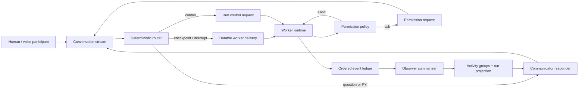
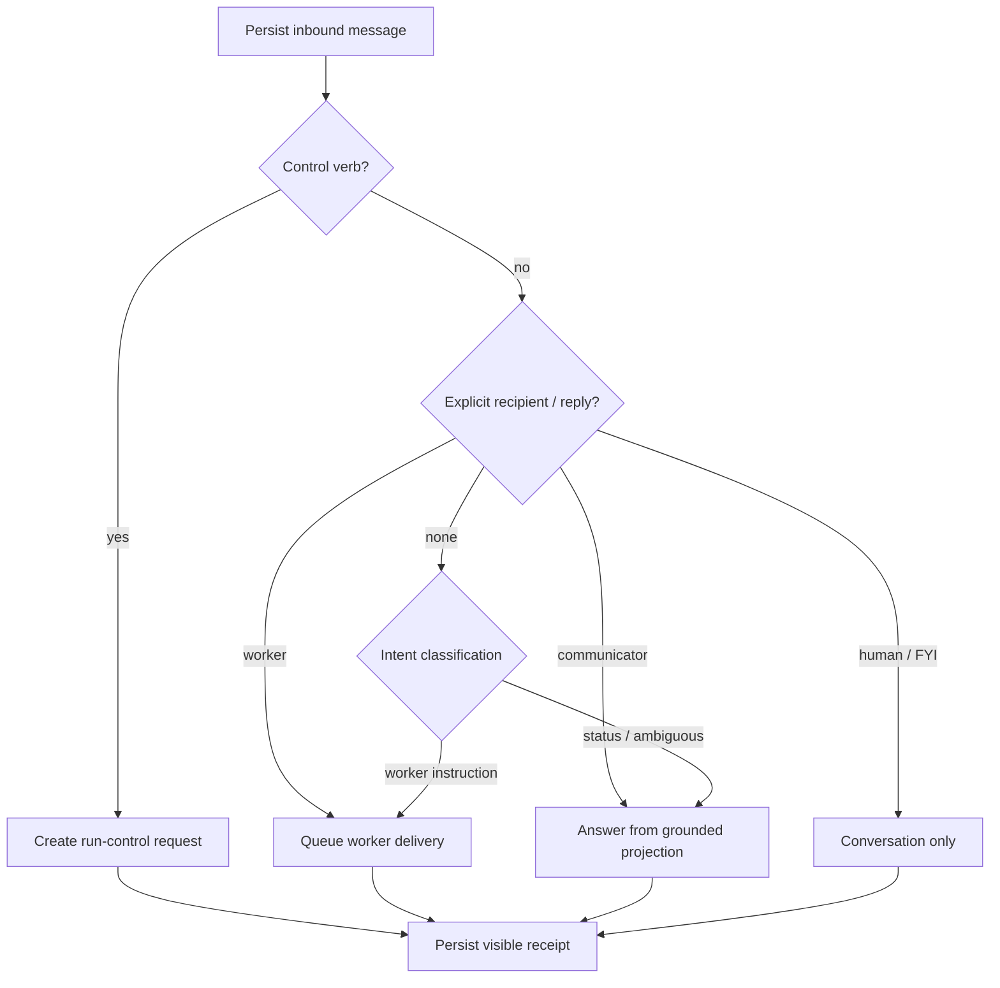

# Thread v2 architecture

Status: additive foundation implemented; observer and coordinator runtime rollout remains feature-gated

## Purpose

Thread v2 separates conversation from execution so a communicator can keep
talking while one or more workers continue running. The same model covers
interactive tasks, scheduled work, Metronome workflows, voice sessions, and
future multi-human threads.

The compatibility constraint is that existing `RunnerChat` and
`RunnerClient.execute()` integrations continue working while the new data plane
is introduced additively. `RunnerChat` subscribes to a v2-only canonical
timeline in production while preserving local legacy turn projections as a
compatibility overlay. Automatic cutover requires durable canonical activity
and no rich legacy-only affordances; explicit canonical mode is available for
controlled rollout, while legacy-only threads continue through the prior turn
model.

The shipped foundation includes the canonical contracts, durable backend event
spine, legacy live mirror, unified Thread UI, deterministic router, grounded
communicator response path, and voice/Metronome adapters. The production model
observer that revises evidence-linked groups and the distributed coordinator
that consumes durable steering/control requests are separate runtime services;
their schemas and UI states are present, but queued requests are never reported
as applied until those services acknowledge them.

## Invariants

1. A thread is a collaboration container, not an execution.
2. Messages and runs link by stable identifiers, never by transcript position.
3. Every thread event receives one atomically allocated sequence number.
4. Events are immutable and idempotent; changing projections receive revisions.
5. Permission rings and policy decisions are authoritative before execution.
6. Observer output is derived, evidence-bound data and cannot grant permission.
7. Worker, observer, and communicator failures are isolated from one another.
8. Concrete actions are loaded lazily; the default timeline contains messages
   and lightweight run projections.
9. The communicator is the default conversational owner. Workers publish run
   results rather than independently taking over the conversation.
10. Voice is a message modality and media transport, not a separate thread type.

## Logical model

```text
Thread
├── Participants
├── Messages
│   └── Delivery receipts
├── Runs
│   ├── Run projection (one-line live summary)
│   ├── Activity groups
│   │   ├── Child groups / child runs
│   │   └── Actions
│   ├── Permission requests
│   └── Artifact changes
└── Ordered event spine
```

Messages, events, actions, and artifacts may use separate physical tables, but
all user-visible activity is correlated through the ordered event spine.

## Runtime roles

- **Worker:** owns workspace and tool access.
- **Permission policy:** synchronously classifies proposed actions and resolves
  allow, ask, or deny independently of the observer.
- **Observer:** incrementally reads structured actions, diffs, tests, and run
  state. It writes versioned activity groups and the live run projection.
- **Router:** applies deterministic controls and explicit addressing before a
  structured model classification.
- **Communicator:** answers from messages, run projections, and observer cards.
  It is read-only with respect to the worker workspace.

The router, observer, and responder may share one visible participant identity,
but must use separate runtime contexts and latency budgets.



The policy path is synchronous and authoritative. Observation and conversation
are asynchronous projections, so neither can silently grant access or block the
worker event path.

## Delivery semantics

Every message accepted by the canonical activity path is persisted before
routing. During compatibility rollout, `RunnerChat` uses the non-persisting
classifier first and sends worker instructions through the legacy execution
queue until the durable coordinator is enabled. Explicit controls and addresses
take precedence over inference in both paths.

```text
fyi         conversation only; never reaches a worker
checkpoint  delivered at the next safe worker boundary (default steering)
interrupt   pauses at the nearest safe boundary before delivery
control     deterministic pause, resume, or cancel operation
```

The UI always renders a durable receipt such as `Answered by Communicator`,
`Queued for Worker`, or `Delivered at action 214`. A message may be answered and
delivered to a worker when both outcomes are useful.



## Observer projection

The collapsed run state contains no raw log preview. It reads a lightweight run
projection containing a one-sentence summary, phase, status, freshness cursor,
highest authoritative ring, and action/group/change counters.

Activity groups explain why a contiguous series of actions occurred. Groups are
versioned through `open`, `sealed`, and `superseded` states and retain evidence
action IDs or sequence ranges. Ring is action metadata and a computed maximum on
the group; it is never the grouping axis.

The default UI exposes three semantic altitudes:

1. Run summary.
2. Activity group or child run.
3. Concrete action, with raw payload in a secondary inspector.

## Transport

The initial timeline is cursor-paginated. Live updates use resumable SSE with an
event `id` equal to the thread sequence. Reconnection first replays events after
the last applied sequence and then tails new events.

```text
GET  /threads/:id/timeline?after=&limit=
GET  /threads/:id/events?after=&limit=&stream=1
GET  /threads/:id/runs
GET  /threads/:id/activity-groups?runId=
GET  /threads/:id/actions?runId=&activityGroupId=
POST /threads/:id/activity/classify
POST /threads/:id/activity/messages
POST /threads/:id/runs/:runId/steering
POST /threads/:id/runs/:runId/control
```

The legacy message execution stream remains available during migration.

The durable coordinator is the remaining execution seam: checkpoint,
interrupt, and control requests are stored with honest `effectApplied: false`
responses, but are not injected into a live worker until a coordinator claims
them. During this rollout, `RunnerChat` keeps worker follow-ups in its existing
page-resident queue; communicator messages, permission rulings, voice
transcripts, runs, and observer projections are already durable Thread v2
events.

Permission decisions retry their canonical mirror idempotently and return
`canonicalMirrored`. A false value is surfaced to the user and should be picked
up by the planned reconciliation worker; the permission authority itself is not
rolled back after a human ruling has already reached the runtime.

## Thread surface

The primary navigation becomes `Thread | Changes`. The Thread projection keeps
the existing conversation layout and anchors a collapsed run card where each run
began. Communicator messages may continue below a live card. Pending permission
requests are promoted out of the collapsed content; resolved requests remain in
the durable group history.

Trace filters move into expanded run cards. A raw trace inspector remains an
advanced diagnostic surface. Changes stays separate and links back to the run,
group, and action that produced each diff.

## Metronome and voice

Each Metronome occurrence receives a collaboration thread containing a parent
workflow run and child worker runs. The triggering source stays linked and is not
absorbed into a synthetic UI-only thread.

Voice sessions persist independent transcript messages with provider item IDs,
provisional/final state, timing, and interruption metadata. Realtime tools only
enqueue long worker runs and return immediately. Barge-in stops communicator
audio without cancelling workers.

The provider-neutral boundary follows the current OpenAI Realtime shape without
making Thread v2 depend on OpenAI: browser/mobile media uses a server-minted
ephemeral credential, the media connection stays open for conversation and tool
events, and tool calls acknowledge durable work rather than waiting for it. The
same adapter can use WebRTC in a browser, WebSocket behind a server media
pipeline, or SIP for telephony. This matches the official
[Realtime overview](https://developers.openai.com/api/docs/guides/realtime),
[Realtime API reference](https://developers.openai.com/api/reference/resources/realtime),
and the tool-using voice behavior described for
[GPT-Realtime-2](https://developers.openai.com/api/docs/models/gpt-realtime-2).

## Migration

1. Add run/event/delivery/group contracts and fixture traces.
2. Dual-write durable runs and ordered events without changing legacy APIs.
3. Add the SDK projection reducer, selectors, cursor client, and legacy adapter.
4. Render the existing UI through the projection, then enable the new run card.
5. Run the observer incrementally and adapt existing trace clusters as fallback.
6. Enable communicator routing and checkpoint steering with visible receipts.
7. Normalize Metronome and voice into the same projection.
8. Remove the primary Trace tab and legacy polling after parity.

## Release gates

- Reconnects introduce no event gaps or duplicate timeline items.
- FYI and status messages never abort workers.
- Every routed message has a visible receipt.
- Permission requests and rulings survive process restarts.
- Observer failure cannot block execution or change a permission ring.
- A 50,000-action run initially loads only lightweight timeline data.
- Raw actions and diffs are fetched only when expanded.
- Raw worker reasoning never appears in the collapsed run headline.
- Voice interruption and worker cancellation remain independent operations.
